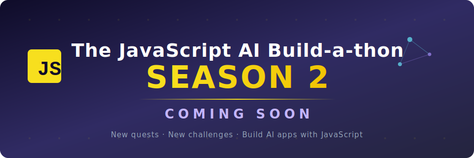

<header>

# The JavaScript AI Build-a-thon

### 🚀 The JavaScript AI Build-a-thon Season 2 — Coming Soon!

**Get ready for new quests, new challenges, and more hands-on AI adventures with JavaScript!** 
📍 Join us in the [#buildathon channel under Hackathons and Events](https://aka.ms/JSAIonDiscord). 
🎙️ [Register for Season 2 Livestreams](https://developer.microsoft.com/reactor/series/S-1628)

---

Unique Hands-On Quests for JavaScript/ TypeScript Developers to Build AI Apps on Microsoft Foundry, and gain a deeper understanding of AI Technologies, Tools and Frameworks. This is a hands-on experience designed for you to work through a series of quests, each designed to guide you through the process of building AI apps step by step.

## 🗺️ How it works

This build-a-thon is organized into **quests** — choose the one that matches your goals and click its badge to begin. The quests are ordered in a sequence that **builds your skills progressively** - so **we recommend starting with the first quest and working your way through them in the given order** for the best learning experience.

## 🏁 Your Quests

| #   | **Quest**                                    | **Tools** |
| --- | ---------------------------------------------| --------------- |
| 01  | | GitHub Models, AI Toolkit Extension |
| 02  |  | Microsoft Foundry Extension |
| 03  |  | Azure Developer CLI (azd), Vite, Lit |
| 04  |  | LangChain.js |
| 05  |  | Next.js, React |
| 06  |  | Microsoft Foundry Agents Service |
| 07  |  | AI Toolkit Extension |
| 08  |  | GitHub Models, GenAIScript |
| 09  |  | Azure Developer CLI (azd) |

✨ [Check the Study Guide for additional resources](https://aka.ms/JSAIStudyGuide) ✨
</header>

---

## Appendix

The JavaScript AI Build-a-thon (June 2025)
 

Developers from all over the world joined us in the AI June Jams with JavaScript - turning their real-world ideas into ready AI apps, through this hands-on learning experience!

#### 🏅 AI Career Navigator - Your Personal AI Career Coach

[Aryanjstar](https://github.com/Aryanjstar)

https://github.com/user-attachments/assets/0bde9089-050a-40d8-8eef-a9bfd92d6e49

#### June 2025 Projects

|Project|Description|Submission|
|---|---|---|
| AI Career Navigator - Your Personal AI Career Coach | An AI-powered career coaching application that analyzes resumes, identifies skill gaps, and guides developers to targeted job opportunities, interview readiness, and skill growth. | [View project](https://github.com/Azure-Samples/JS-AI-Build-a-thon/issues/47) |
| ACTS Sri Lanka | An AI-powered legal assistant for Sri Lankan government documents that enables fast, citation-backed legal Q&A and search for citizens and professionals. | [View project](https://github.com/Azure-Samples/JS-AI-Build-a-thon/issues/42) |
| JuaKatiba AI Agent | A serverless RAG-powered chatbot that explains and interprets Kenyan legal and constitutional documents, empowering citizens to defend their rights. | [View project](https://github.com/Azure-Samples/JS-AI-Build-a-thon/issues/41) |
| You okay? Meet Vish AI, your mental health companion | An AI chatbot using RAG and LangChain for empathetic conversation and resource-based emotional wellness support whenever needed. | [View project](https://github.com/Azure-Samples/JS-AI-Build-a-thon/issues/38) |
| vmware-tools-broadcom | A Python tool that automatically syncs, archives, and manages VMware Tools from Broadcom, saving time and providing easy access for IT users. | [View project](https://github.com/Azure-Samples/JS-AI-Build-a-thon/issues/37) |
| Onboarding Software | A customizable recruitment and access platform leveraging azd templates to streamline candidate screening and enable healthy workplace culture. | [View project](https://github.com/Azure-Samples/JS-AI-Build-a-thon/issues/36) |
| Deepmine-Sentinel | An AI safety assistant built on a chat template for providing miners with real-time underground safety guidance and accident prevention monitoring. | [View project](https://github.com/Azure-Samples/JS-AI-Build-a-thon/issues/29) |
| Climate Action Assistant | An intelligent AI-powered climate action coach that delivers personalized, location-aware, and gamified environmental advice to help users reduce their carbon footprint effectively. | [View project](https://github.com/Azure-Samples/JS-AI-Build-a-thon/issues/48) |
| AI FODMAP Food Helper | A friendly AI shopping companion that provides instant FODMAP ratings and tailored IBS-safe grocery advice, making the low FODMAP diet accessible and stress-free. | [View project](https://github.com/Azure-Samples/JS-AI-Build-a-thon/issues/46) |
| healthy-living advisor | A health-focused AI chat app offering personalized, evidence-based, and accessible wellness, nutrition, and exercise advice. | [View project](https://github.com/Azure-Samples/JS-AI-Build-a-thon/issues/54) |
| FitMind AI | An AI-powered wellness assistant that delivers personalized workout plans, healthy diet advice, and mental well-being tips for physical and mental health improvement. | [View project](https://github.com/Azure-Samples/JS-AI-Build-a-thon/issues/44) |
| MrBones💪🦴.ai | An interactive AI anatomy assistant that transforms learning about the human skeletal system into an engaging, cloud-based virtual tutor and lab experience. | [View project](https://github.com/Azure-Samples/JS-AI-Build-a-thon/issues/49) |
| Academic Advisor AI - Course Discovery & Degree Planning | A specialized RAG-powered AI system that provides intelligent course recommendations, prerequisite guidance, and academic pathway planning for students across multiple degree clusters. | [View project](https://github.com/Azure-Samples/JS-AI-Build-a-thon/issues/50) |
| Cyby-Sec | An AI-driven cybersecurity chatbot that educates users, detects threats, and assists with real-time incident response through natural, human-like conversational guidance. | [View project](https://github.com/Azure-Samples/JS-AI-Build-a-thon/issues/57) |
| AI-Mental--Wellness-Chatbot | An AI-powered mental wellness assistant that delivers empathetic conversations, stress relief guidance, and motivational support through a private chat interface. | [View project](https://github.com/Azure-Samples/JS-AI-Build-a-thon/issues/61) |
| Your AI prompt assistant, PromptFix | An intelligent prompt engineering assistant that analyzes, debugs, and improves user prompts while providing AI-driven guidance for effective generative AI interactions. | [View project](https://github.com/Azure-Samples/JS-AI-Build-a-thon/issues/60) |
| AI Travel Guide for Sri Lanka | A conversational GenAI assistant that offers reliable, document-based travel guidance and local recommendations tailored specifically for visitors to Sri Lanka. | [View project](https://github.com/Azure-Samples/JS-AI-Build-a-thon/issues/59) |
| The Cofounder Who Never Sleeps, inizio.ai | An AI cofounder assistant that provides idea validation, step-by-step startup guidance, and emotionally intelligent mentoring for solo entrepreneurs. | [View project](https://github.com/Azure-Samples/JS-AI-Build-a-thon/issues/58) |
| Doctor AI | An AI health companion that offers real-time symptom triage, lifestyle advice, and always-available access for remote and underserved populations. | [View project](https://github.com/Azure-Samples/JS-AI-Build-a-thon/issues/62) |
| WanderWhiz Bot | An AI-powered travel assistant that offers personalized, city-specific guidance and real-time tips for travelers through a chat interface. | [View project](https://github.com/Azure-Samples/JS-AI-Build-a-thon/issues/63) |
| MediBot: AI Medical Symptom & Disease Assistant | An AI medical assistant that uses curated medical resources to provide instant, reliable answers about symptoms, diseases, and when to seek care. | [View project](https://github.com/Azure-Samples/JS-AI-Build-a-thon/issues/51) |
| Muse AI | An AI-powered platform that uses an enhanced API template to foster self-reflection and empathy through engaging prompts and conversational logic. | [View project](https://github.com/Azure-Samples/JS-AI-Build-a-thon/issues/71) |
| PetPal - Your AI Pet Care Assistant | A highly customized, serverless conversational AI assistant that delivers instant, personalized pet health and care guidance using Azure OpenAI and LangChain.js. | [View project](https://github.com/Azure-Samples/JS-AI-Build-a-thon/issues/70) |
| Education AI | An AI assistant using customized chat-with-your-data for fast student Q&A, quiz creation, and teacher dashboards from school content. | [View project](https://github.com/Azure-Samples/JS-AI-Build-a-thon/issues/69) |
| EcoGuardian: Your AI-Powered Carbon Footprint Tracker & Sustainability Coach | A scalable platform using Azure and JavaScript frameworks to track personal carbon emissions, provide AI-driven sustainability advice, and visualize impact for users. | [View project](https://github.com/Azure-Samples/JS-AI-Build-a-thon/issues/68) |
| MLSA LearnBot | An intelligent chatbot for Microsoft Learn Student Ambassadors that provides instant answers, integrated documentation, and a student-focused experience through Azure OpenAI and AI Search. | [View project](https://github.com/Azure-Samples/JS-AI-Build-a-thon/issues/67) |
| DocuChat AI | An AI chat app that enables users to interact conversationally with complex documents through RAG, memory, and semantic search for expert-level answers. | [View project](https://github.com/Azure-Samples/JS-AI-Build-a-thon/issues/66) |

---

## 🤝 Community 

If you get stuck or have any questions about building AI apps. Join fellow learners and experienced developers in discussions about Microsoft Foundry and AI Integrations. It's a supportive community where questions are welcome and knowledge is shared freely.

If you have product feedback or errors while building visit:

&copy; 2025 JavaScript at Microsoft &bull; [Code of Conduct](https://www.contributor-covenant.org/version/2/1/code_of_conduct/code_of_conduct.md) &bull; [MIT License](https://gh.io/mit)
</footer>
