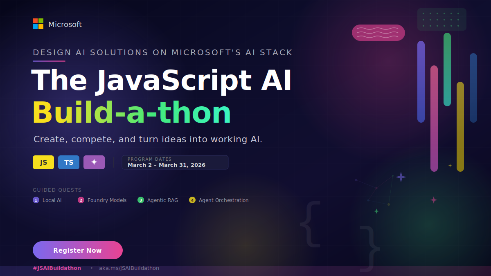
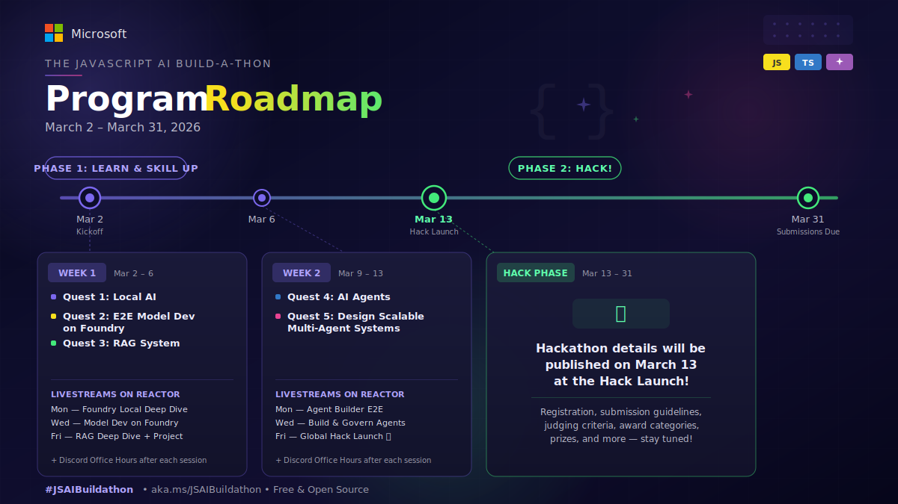

<header>

  <strong>Create, compete, and turn ideas into working AI.</strong> 
  <em>Starting March 2, 2026</em>

  &nbsp;
  &nbsp;
  &nbsp;
  

[Register today](https://aka.ms/JSAIBuildathon)

---

# What is the JavaScript AI Build-a-thon?

The JavaScript AI Build-a-thon is a focused, hands-on initiative that helps **builders** quickly move from exploration to working AI prototypes. Through concise quests and practical demos, you'll gain real skills with modern AI tools in a clear, outcome-driven format.

**This isn't just another hackathon. It's your launchpad into the Agentic future of JavaScript and TypeScript development.**

If you're building your first AI app or architecting multi-agent systems, the Build-a-thon gives you the tools, the mentorship, and the stage to ship something real.

# Key Dates

| Milestone | Date |
|---|---|
| 🎬 Build-a-thon Begins | **Monday, March 2, 2026** |
| 📚 Quests & Livestreams | **March 2 – March 13, 2026** |
| **🔥 Hackathon Launches** | **Friday, March 13, 2026** |
| 🏁 Hackathon Ends | **Tuesday, March 31, 2026** |

# How It Works

The Build-a-thon runs in two phases.

## 📚 Phase 1: Learn & Skill Up (March 2 – March 13)

Complete guided quests and attend expert-led livestreams to build the skills you'll need. Each quest is hands-on, self-paced, and designed to teach you a core AI development pattern with JavaScript/TypeScript:

> *Season 2 Quests will go live on Monday March 2, 2026.*

### Livestream Schedule

Expert-led sessions streamed live on Microsoft Reactor, covering everything from local AI development to production-grade agent architectures.

#### Week 1: March 2 – March 6

| Day/Time (PT) | Topic | Links to join |
|---|---|---|
| Mon 3/2, 8:00 AM PST | Local AI Development with Foundry Local | [Livestream](https://developer.microsoft.com/en-us/reactor/events/26772/)   [Discord Office Hour](https://discord.gg/microsoftfoundry?event=1465380906842853666)|
| Wed 3/4, 8:00 AM PST | End-to-End Model Development on Microsoft Foundry | [Livestream](https://developer.microsoft.com/en-us/reactor/events/26773/)   [Discord Office Hour](https://discord.gg/microsoftfoundry?event=1470927803888173109)|
| Fri 3/6, 9:00 AM PST | Advanced RAG Deep Dive + Guided Project | [Livestream](https://developer.microsoft.com/en-us/reactor/events/26775)   [Discord Office Hour](https://discord.gg/microsoftfoundry?event=1465381686362509323)|

#### Week 2: March 9 – March 13

| Day/Time (PT) | Topic | Links to join |
|---|---|---|
| Mon 3/9, 8:00 AM PST | Design & Build an Agent E2E with Agent Builder (AITK) | [Livestream](https://developer.microsoft.com/en-us/reactor/events/26776/)   [Discord Office Hour](https://discord.gg/microsoftfoundry?event=1465382167894036481)|
| Wed 3/11, 8:00 AM PST | Build, Scale & Govern AI Agents + Guided project | [Livestream](https://developer.microsoft.com/en-us/reactor/events/26786/)   [Discord Office Hour](https://discord.gg/microsoftfoundry?event=1465382908687814840)|
| Fri 3/13, 8:00 AM PST | Build-a-thon Global Hack Launch | [Livestream](https://developer.microsoft.com/en-us/reactor/events/26777/)   [Discord Office Hour](https://discord.gg/microsoftfoundry?event=1470930191994847343)|

## 🔥 Phase 2: Hack! (March 13 – March 31)

Build something that matters. Use everything you learned in the quests, and beyond, to create an AI-powered project that solves a real problem, delights users, or pushes what's possible.

> **The hackathon launches on March 13, 2026.** Full details on registration, submission, judging criteria, award categories, prizes, and the hack phase schedule will be published when the hack goes live. Stay tuned!

Here's what we can tell you now:

- 🏆 **6 award categories** with cash prizes
- 💻 **Product demo showcases** throughout the hack phase to keep you building with the latest tools
- 👥 Teams of up to 4 or solo — your call

## 💬 Community & Support

Join our community to connect with other participants and experts from Microsoft &. GitHub to support your builder journey.

- **Foundry Discord** (#js-ai-build-a-thon channel): [Our platform for office hours, live QnA, quick questions, community & expert support](https://aka.ms/JSAIonDiscord)
- **GitHub Discussions:** [This is where you'll share ideas, ask questions, find teammates](https://aka.ms/JSAI_Discussions)
- **Social:** Share your progress online using **#JSAIBuildathon**

## Appendix

The JavaScript AI Build-a-thon (June 2025)
 

Developers from all over the world joined us in the AI June Jams with JavaScript - turning their real-world ideas into ready AI apps, through this hands-on learning experience!

## 🏅 AI Career Navigator - Your Personal AI Career Coach

[Aryanjstar](https://github.com/Aryanjstar)

https://github.com/user-attachments/assets/0bde9089-050a-40d8-8eef-a9bfd92d6e49

## June 2025 Projects

|Project|Description|Submission|
|---|---|---|
| AI Career Navigator - Your Personal AI Career Coach | An AI-powered career coaching application that analyzes resumes, identifies skill gaps, and guides developers to targeted job opportunities, interview readiness, and skill growth. | [View project](https://github.com/Azure-Samples/JS-AI-Build-a-thon/issues/47) |
| ACTS Sri Lanka | An AI-powered legal assistant for Sri Lankan government documents that enables fast, citation-backed legal Q&A and search for citizens and professionals. | [View project](https://github.com/Azure-Samples/JS-AI-Build-a-thon/issues/42) |
| JuaKatiba AI Agent | A serverless RAG-powered chatbot that explains and interprets Kenyan legal and constitutional documents, empowering citizens to defend their rights. | [View project](https://github.com/Azure-Samples/JS-AI-Build-a-thon/issues/41) |
| You okay? Meet Vish AI, your mental health companion | An AI chatbot using RAG and LangChain for empathetic conversation and resource-based emotional wellness support whenever needed. | [View project](https://github.com/Azure-Samples/JS-AI-Build-a-thon/issues/38) |
| vmware-tools-broadcom | A Python tool that automatically syncs, archives, and manages VMware Tools from Broadcom, saving time and providing easy access for IT users. | [View project](https://github.com/Azure-Samples/JS-AI-Build-a-thon/issues/37) |
| Onboarding Software | A customizable recruitment and access platform leveraging azd templates to streamline candidate screening and enable healthy workplace culture. | [View project](https://github.com/Azure-Samples/JS-AI-Build-a-thon/issues/36) |
| Deepmine-Sentinel | An AI safety assistant built on a chat template for providing miners with real-time underground safety guidance and accident prevention monitoring. | [View project](https://github.com/Azure-Samples/JS-AI-Build-a-thon/issues/29) |
| Climate Action Assistant | An intelligent AI-powered climate action coach that delivers personalized, location-aware, and gamified environmental advice to help users reduce their carbon footprint effectively. | [View project](https://github.com/Azure-Samples/JS-AI-Build-a-thon/issues/48) |
| AI FODMAP Food Helper | A friendly AI shopping companion that provides instant FODMAP ratings and tailored IBS-safe grocery advice, making the low FODMAP diet accessible and stress-free. | [View project](https://github.com/Azure-Samples/JS-AI-Build-a-thon/issues/46) |
| healthy-living advisor | A health-focused AI chat app offering personalized, evidence-based, and accessible wellness, nutrition, and exercise advice. | [View project](https://github.com/Azure-Samples/JS-AI-Build-a-thon/issues/54) |
| FitMind AI | An AI-powered wellness assistant that delivers personalized workout plans, healthy diet advice, and mental well-being tips for physical and mental health improvement. | [View project](https://github.com/Azure-Samples/JS-AI-Build-a-thon/issues/44) |
| MrBones💪🦴.ai | An interactive AI anatomy assistant that transforms learning about the human skeletal system into an engaging, cloud-based virtual tutor and lab experience. | [View project](https://github.com/Azure-Samples/JS-AI-Build-a-thon/issues/49) |
| Academic Advisor AI - Course Discovery & Degree Planning | A specialized RAG-powered AI system that provides intelligent course recommendations, prerequisite guidance, and academic pathway planning for students across multiple degree clusters. | [View project](https://github.com/Azure-Samples/JS-AI-Build-a-thon/issues/50) |
| Cyby-Sec | An AI-driven cybersecurity chatbot that educates users, detects threats, and assists with real-time incident response through natural, human-like conversational guidance. | [View project](https://github.com/Azure-Samples/JS-AI-Build-a-thon/issues/57) |
| AI-Mental--Wellness-Chatbot | An AI-powered mental wellness assistant that delivers empathetic conversations, stress relief guidance, and motivational support through a private chat interface. | [View project](https://github.com/Azure-Samples/JS-AI-Build-a-thon/issues/61) |
| Your AI prompt assistant, PromptFix | An intelligent prompt engineering assistant that analyzes, debugs, and improves user prompts while providing AI-driven guidance for effective generative AI interactions. | [View project](https://github.com/Azure-Samples/JS-AI-Build-a-thon/issues/60) |
| AI Travel Guide for Sri Lanka | A conversational GenAI assistant that offers reliable, document-based travel guidance and local recommendations tailored specifically for visitors to Sri Lanka. | [View project](https://github.com/Azure-Samples/JS-AI-Build-a-thon/issues/59) |
| The Cofounder Who Never Sleeps, inizio.ai | An AI cofounder assistant that provides idea validation, step-by-step startup guidance, and emotionally intelligent mentoring for solo entrepreneurs. | [View project](https://github.com/Azure-Samples/JS-AI-Build-a-thon/issues/58) |
| Doctor AI | An AI health companion that offers real-time symptom triage, lifestyle advice, and always-available access for remote and underserved populations. | [View project](https://github.com/Azure-Samples/JS-AI-Build-a-thon/issues/62) |
| WanderWhiz Bot | An AI-powered travel assistant that offers personalized, city-specific guidance and real-time tips for travelers through a chat interface. | [View project](https://github.com/Azure-Samples/JS-AI-Build-a-thon/issues/63) |
| MediBot: AI Medical Symptom & Disease Assistant | An AI medical assistant that uses curated medical resources to provide instant, reliable answers about symptoms, diseases, and when to seek care. | [View project](https://github.com/Azure-Samples/JS-AI-Build-a-thon/issues/51) |
| Muse AI | An AI-powered platform that uses an enhanced API template to foster self-reflection and empathy through engaging prompts and conversational logic. | [View project](https://github.com/Azure-Samples/JS-AI-Build-a-thon/issues/71) |
| PetPal - Your AI Pet Care Assistant | A highly customized, serverless conversational AI assistant that delivers instant, personalized pet health and care guidance using Azure OpenAI and LangChain.js. | [View project](https://github.com/Azure-Samples/JS-AI-Build-a-thon/issues/70) |
| Education AI | An AI assistant using customized chat-with-your-data for fast student Q&A, quiz creation, and teacher dashboards from school content. | [View project](https://github.com/Azure-Samples/JS-AI-Build-a-thon/issues/69) |
| EcoGuardian: Your AI-Powered Carbon Footprint Tracker & Sustainability Coach | A scalable platform using Azure and JavaScript frameworks to track personal carbon emissions, provide AI-driven sustainability advice, and visualize impact for users. | [View project](https://github.com/Azure-Samples/JS-AI-Build-a-thon/issues/68) |
| MLSA LearnBot | An intelligent chatbot for Microsoft Learn Student Ambassadors that provides instant answers, integrated documentation, and a student-focused experience through Azure OpenAI and AI Search. | [View project](https://github.com/Azure-Samples/JS-AI-Build-a-thon/issues/67) |
| DocuChat AI | An AI chat app that enables users to interact conversationally with complex documents through RAG, memory, and semantic search for expert-level answers. | [View project](https://github.com/Azure-Samples/JS-AI-Build-a-thon/issues/66) |

---

&copy; 2026 JavaScript at Microsoft &bull; [Code of Conduct](https://www.contributor-covenant.org/version/2/1/code_of_conduct/code_of_conduct.md) &bull; [MIT License](https://gh.io/mit)
</footer>
