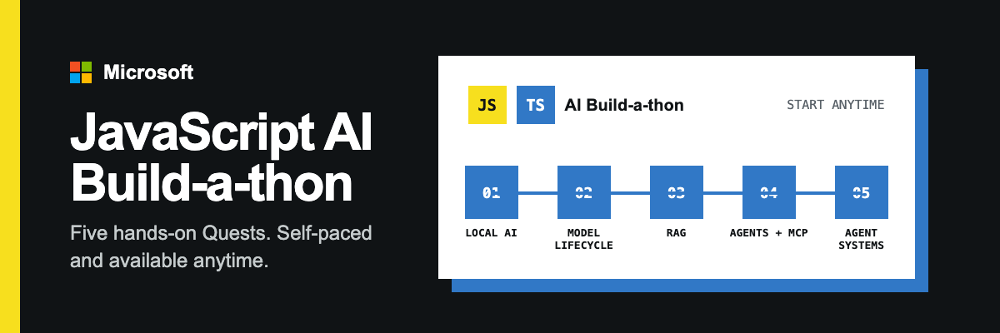

# JavaScript AI Build-a-thon

**Learn AI with JavaScript and TypeScript through hands-on Quests.**

Self-paced. Open source. Up-to-date.

[Start with Quest 1](./01-Local-AI-Development/README.md) ·
[Browse all Quests](https://azure-samples.github.io/JavaScript-AI-Buildathon/quests/) ·
[Read the learning guide](https://azure-samples.github.io/JavaScript-AI-Buildathon/start-here/)

---

## Start here

This repository is for JavaScript and TypeScript developers who want to learn
AI by building. You do not need to complete everything at once: choose the
Quest that matches your goal, follow it at your own pace, and return whenever
you are ready for the next pattern.

New to AI development? Begin with local models in Quest 1, then move through
the learning path in order. Already comfortable with models and retrieval?
Start with the agent-focused Quests.

## The learning path

| Quest | Build and explore | Environment |
|---|---|---|
| [1. Local AI Development](./01-Local-AI-Development/README.md) | Run models on-device and connect them to a JavaScript application | Local |
| [2. End-to-End Model Development](./02-E2E-Model-Development-on-Foundry/README.md) | Select, customize, evaluate, trace, and protect models with Microsoft Foundry | Cloud |
| [3. Serverless RAG Support System](./03-Run-Serverless-RAG-Support-System/README.md) | Build document ingestion, retrieval, grounded responses, streaming, and chat history | Local & Cloud |
| [4. Build Agents with AI Toolkit](./04-Build-Agents-with-AIToolKit/README.md) | Compare models, build agents, connect MCP tools, evaluate responses, and export code | Local & Cloud |
| [5. Burger Ordering Agent System](./05-Run-Burger-Ordering-Agent-System/README.md) | Explore a complete multi-service agent system with MCP integrations | Local & Cloud |

### Foundations

Quests 1-3 cover three core AI application patterns: running models locally,
working through an end-to-end model lifecycle, and grounding responses with
retrieval-augmented generation.

### Agents

Quests 4-5 move into agent design, MCP tool use, evaluation, orchestration, and
the boundaries between an agent, its APIs, and external services.

## How to use the Quests

1. Open a Quest and review its prerequisites before starting.
2. Follow the setup and hands-on steps in the Quest README.
3. Use the optional recording at the top of a Quest when you want a guided walkthrough.
4. Adapt the scenario or data to reinforce what you learned.
5. Continue to the next Quest or choose another path from this page.

Cloud-based Quests can create costs. Review each Quest's notes and remove cloud
resources when you finish.

## Community and support

- [Join the JavaScript AI community on Discord](https://aka.ms/JSAIonDiscord)
- [Report a problem or suggest an improvement](https://github.com/Azure-Samples/JavaScript-AI-Buildathon/issues/new/choose)
- [Explore the documentation site](https://azure-samples.github.io/JavaScript-AI-Buildathon/)

## Appendix

<strong>March 2026 program archive</strong>

The March 2026 program introduced these five Quests through live sessions and
a project-building program. Its winning projects, participant submissions, and
reference links are preserved in the
[program archive](https://azure-samples.github.io/JavaScript-AI-Buildathon/appendix/#march-2026-program).

<strong>June 2025 program archive</strong>

The June 2025 program brought together developers who turned real-world ideas
into AI applications. Its project showcase is preserved in the
[program archive](https://azure-samples.github.io/JavaScript-AI-Buildathon/appendix/#june-2025-program).

---

JavaScript at Microsoft ·
[Code of Conduct](https://www.contributor-covenant.org/version/2/1/code_of_conduct/code_of_conduct.md) ·
[MIT License](https://gh.io/mit)
