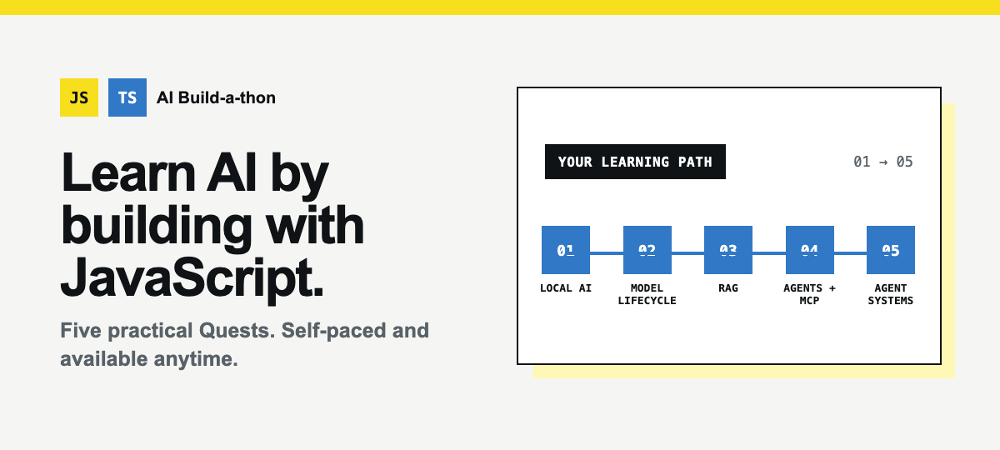

---
hide:
  - navigation
  - toc
---

  <h1 class="visually-hidden">Learn AI by building with JavaScript</h1>
  
Five hands-on Quests, self-paced and available anytime.

  

    <video
      data-hero-video
      autoplay
      muted
      loop
      playsinline
      preload="metadata"
      poster="media/hero/learning-path-poster.png"
      aria-hidden="true"
    >
      <source src="media/hero/learning-path.webm" type="video/webm">
      <source src="media/hero/learning-path.mp4" type="video/mp4">
    </video>
    
    <button class="hero-motion-toggle" type="button" data-hero-toggle>
      Pause animation
    </button>
  

  

    
<strong>Self-paced. Open source. Available anytime.</strong>

    <a class="md-button md-button--primary" href="https://github.com/Azure-Samples/JavaScript-AI-Buildathon/tree/main/01-Local-AI-Development">Start with Quest 1</a>
    <a class="md-button" href="quests/">Choose a Quest</a>
  

## One path, five practical outcomes

<ol class="learning-path">
  <li>
    <strong>Run AI locally</strong>
    Use on-device models for privacy, speed, and offline access.
  </li>
  <li>
    <strong>Understand the model lifecycle</strong>
    Explore selection, customization, evaluation, tracing, and AI red teaming.
  </li>
  <li>
    <strong>Ground responses with your data</strong>
    Build a RAG pipeline with ingestion, retrieval, citations, streaming, and history.
  </li>
  <li>
    <strong>Build and evaluate an agent</strong>
    Compare models, connect MCP tools, test responses, and export working code.
  </li>
  <li>
    <strong>Explore a complete agent system</strong>
    Trace how an agent, APIs, MCP services, and application interfaces work together.
  </li>
</ol>

## Choose your starting point

### New to AI development

Begin with [Quest 1: Local AI Development](https://github.com/Azure-Samples/JavaScript-AI-Buildathon/tree/main/01-Local-AI-Development),
then follow the Quests in order. Each introduces a new pattern while keeping
JavaScript or TypeScript at the center.

### Ready for retrieval or agents

Go directly to the [Quest directory](quests.md) to compare outcomes,
environments, and prerequisites before choosing your path.

## Learn on your schedule

Every Quest is available whenever you are. Work through the written guide,
use the optional recording when a walkthrough helps, and adapt the examples to
your own scenario.

[Read the start guide](start-here.md){ .md-button .md-button--primary }

Looking for earlier program results?
<a href="appendix/">Visit the program archive</a>.

