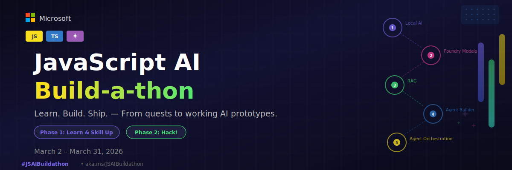

---
hide:
  - navigation
---

---

🏆

# 🎉 And the Winners Are...

The JavaScript AI Build-a-thon has concluded! Thank you to every builder who turned bold ideas into working AI. Here are the projects that stood out.

## 🏆 Award Winners

🥇

GRAND PRIZE

$1,000

CivicLens AI

A multi-agent AI pipeline that transforms invisible municipal infrastructure data into plain-language intelligence reports, dispatches repair crews, and predicts infrastructure failures — all in JavaScript.

<a href="https://github.com/JonEricEubanks/CivicLens">📂 Repository</a>
<a href="https://portfolio-jet-five-57.vercel.app/#blog">📝 Blog Post</a>
<a href="https://civiclens-app.azurewebsites.net/">🌐 Live App</a>
<a href="https://youtu.be/rFCUO5acv5Q">▶️ Demo Video</a>

🥈

OFFLINE-READY AI AWARD

$500

SourcingIntel

AI-Powered Supply Chain Intelligence Platform with on-device inference.

<a class="primary" href="https://github.com/Kalyan-AI-Hub/SourcingIntel">📂 Repo</a>
<a class="secondary" href="https://dev.to/kalyan_8b63839572c8a7db1b/building-sourcing-intel-an-ai-powered-supply-chain-intelligence-platform-with-on-device-inference-4kdi">📝 Blog</a>
<a class="secondary" href="https://youtu.be/CEXyfcWrI_8?si=dO9tQwln6T3ZZDZM">▶️ Demo</a>

🥉

AGENTIC SYSTEM ARCHITECTURE

$500

Agile Sprint Orchestrator

The Intelligence Layer That Runs Your Sprint — a multi-agent system for autonomous agile lifecycle management.

<a class="primary" href="https://github.com/snehasankaran/agile-sprint-orchestrator">📂 Repo</a>
<a class="secondary" href="https://agile-sprint-orchestrator-h9ks.vercel.app/">🌐 App</a>
<a class="secondary" href="https://youtu.be/7eUrJVtNtbQ?si=SrvPo9sBhvHhpoeE">▶️ Demo</a>

## 🚀 All Submissions

Every project that participated in the JavaScript AI Build-a-thon — celebrating builders from around the world.

Sauti Porini

An autonomous AI agent that shifts forest conservation from passive to proactive monitoring using deterministic state-machine logic, IoT, and satellite intelligence.

<a class="repo" href="https://github.com/Gerald-mut/Sauti-Porini-Js">📂 Repo</a>
<a class="blog" href="https://medium.com/@muterugerald/building-sauti-porini-356c7e01c225">📝 Blog</a>
<a class="video" href="https://youtu.be/-lXLX5dN_T4?si=M4cLJqrlox-HQNoR">▶️ Video</a>

Talewind

An AI story tutor that learns every child's world — then teaches them through a story that feels like it was made just for them.

<a class="repo" href="https://github.com/digitalfl0wer/taleWind">📂 Repo</a>

Superhuman AI Chief of Staff

The AI Operating System for Organizational Intelligence — a multi-agent intelligence layer for the company brain.

<a class="repo" href="https://github.com/snjugunanjenga/org-flow-ai/">📂 Repo</a>
<a class="blog" href="https://medium.com/@simonnjenganjuguna/superhuman-ai-chief-of-staff-074cf4b2af34">📝 Blog</a>
<a class="app" href="https://org-ai-chief-of-staff.vercel.app/">🌐 App</a>
<a class="video" href="https://www.youtube.com/watch?v=wJXagm1TU18">▶️ Video</a>

AI Policy Explainer

Policies from colleges, companies, and governments — now easy to understand.

<a class="repo" href="https://github.com/scha54/AI-Policy-Explainer">📂 Repo</a>
<a class="blog" href="https://medium.com/@sandeepchakravartty/building-a-grounded-pdf-q-a-agent-with-react-express-and-rag-4fc03cbc6741">📝 Blog</a>
<a class="video" href="https://youtu.be/S_BTCm2UKh0?si=N7fuAt1PPhK1W_o7">▶️ Video</a>

Matchflow

The Intelligence Layer Connecting Brands and Creators — a multi-agent system for autonomous negotiation.

<a class="repo" href="https://github.com/tilakgupta2005/Matchflow">📂 Repo</a>
<a class="blog" href="https://tilak-dev.vercel.app/blog/matchflow-autonomous-ai-negotiation-engine">📝 Blog</a>
<a class="app" href="https://matchflow-ai.vercel.app/">🌐 App</a>
<a class="video" href="https://youtu.be/LqKXRuOoUCc?si=ElvTHyQ52sn--tlv">▶️ Video</a>

KrishiAI

AI-powered farming assistant for Indian farmers with disease detection, multi-language chat, crop recommendations, price forecasting, and fertilizer optimization.

<a class="repo" href="https://github.com/ManishKumawat450/KrishiAi">📂 Repo</a>
<a class="blog" href="https://dev.to/manish_kumawat_0202f769e7/building-real-ai-in-24-hours-krishiai-with-github-copilot-9ml">📝 Blog</a>
<a class="video" href="https://youtu.be/3G2sJmo3rnk?si=CXRS1YUWXtZnj7be">▶️ Video</a>

Mauzoplus

Smarter Sales, Powered by AI for Africa.

<a class="blog" href="https://docs.mauzoplus.app/">📝 Blog</a>
<a class="video" href="https://youtu.be/fE7_CjSJ0cs?si=wz3wpIjkW_3Qx1T8">▶️ Video</a>

GlobeTrotter

A fun, LLM-powered way to discover landmarks on a globe.

<a class="repo" href="https://github.com/BY3D/Globetrotter-Build-a-Thon-2026">📂 Repo</a>
<a class="video" href="https://vimeo.com/1178243103?share=copy">▶️ Video</a>

AccessBridge AI

A multi-agent AI system that transforms any web page into universally accessible content — five specialized agents collaborate to detect and auto-fix accessibility barriers.

<a class="repo" href="https://github.com/jpablortiz96/accessbridge-ai">📂 Repo</a>
<a class="blog" href="https://dev.to/jpablortiz96/building-accessbridge-ai-how-5-ai-agents-collaborate-to-make-the-web-accessible-24kf">📝 Blog</a>
<a class="app" href="https://accessbridge-ai.vercel.app/">🌐 App</a>
<a class="video" href="https://youtu.be/SFbjWWApP4M?si=8act2mG6aXXszGI8">▶️ Video</a>

CODE2FLOW AI

AI-Powered Code Visualizer — see your code architecture come to life.

<a class="repo" href="https://github.com/shreeplays/Microsoft-hackathon">📂 Repo</a>
<a class="blog" href="https://dev.to/forgotten_areeb/code2flow-ai-visualizing-code-architecture-using-ai-24">📝 Blog</a>
<a class="video" href="https://youtu.be/OG_b3GTaV6o">▶️ Video</a>

Multi-Agent Meeting Intelligence Assistant

A real-time, AI-powered meeting assistant built with TypeScript and multi-agent orchestration.

<a class="repo" href="https://github.com/Malvine254/Missa-The-Translator">📂 Repo</a>
<a class="blog" href="https://malvine254.github.io/meeting-intelligence-assistant/">📝 Blog</a>
<a class="video" href="https://youtu.be/yo6T_LnPowg?si=kjVIm_z2pzGAH5ZQ">▶️ Video</a>

Water Quality Control

Healthy lives begin with safe water and sanitation.

<a class="repo" href="https://github.com/ZEEZCO/Water-Quality-Analysis-Analyzer-">📂 Repo</a>
<a class="video" href="https://youtu.be/xxae9aRmhlk?si=AWzncU7HjXAgGt9G">▶️ Video</a>

InboxShield AI

Email Security, Fraud Detection, Cybersecurity.

<a class="repo" href="https://github.com/peymosiec01/inboxshield-ai">📂 Repo</a>

AfyaPack

An offline-first AI clinical decision support tool for community health workers in East Africa — protocol-grounded guidance in English and Swahili.

<a class="repo" href="https://github.com/DaymondMartin/AfyaPack">📂 Repo</a>
<a class="blog" href="https://daymondmartin.github.io/AfyaPack/">📝 Blog</a>
<a class="video" href="https://youtu.be/Hlb94C4W2Ps?si=l_c_ZAyqWAGwEVT8">▶️ Video</a>

ContextGuard AI

A grounded MERN study assistant with flashcards, Mermaid diagrams, and more.

<a class="repo" href="https://github.com/x88-code/JS-AI-Build-a-thon-Hack">📂 Repo</a>
<a class="blog" href="https://dev.to/x88code/building-contextguard-ai-a-grounded-mern-study-assistant-with-flashcards-mermaid-diagrams-and-15h1">📝 Blog</a>
<a class="app" href="https://js-ai-build-a-thon-hack.vercel.app/">🌐 App</a>
<a class="video" href="https://youtu.be/nTpxgDchvas?si=YBfrVYMF03quDmFD">▶️ Video</a>

Tuwon

Test your knowledge through interactive activities with a real-time AI proctor.

<a class="repo" href="https://github.com/nerdeulivrian/tuwon.dev">📂 Repo</a>
<a class="blog" href="https://medium.com/@ian_52882/building-tuwon-an-ai-study-platform-that-talks-back-968a44b66bf1">📝 Blog</a>
<a class="app" href="https://www.tuwon.app/">🌐 App</a>
<a class="video" href="https://youtu.be/fneyfto0pTw?si=zPEyvzfRxIKUi0HJ">▶️ Video</a>

Neural Math Lab

See the math, learn the steps, and level up your skills — online or offline, with an AI that's a partner, not a cheat sheet.

<a class="repo" href="https://github.com/dev-Adhithiya/Neural-Math-Lab">📂 Repo</a>
<a class="blog" href="https://dev.to/devadhithiya/beyond-the-chatbot-engineering-a-hybrid-ai-math-tutor-for-the-future-86g">📝 Blog</a>
<a class="app" href="https://dev-adhithiya.github.io/Neural-Math-Lab/">🌐 App</a>
<a class="video" href="https://youtu.be/-IjN8eADVoA?si=UaoUX5HvlNJh7nYm">▶️ Video</a>

## 💬 Community & Support

-   <svg xmlns="http://www.w3.org/2000/svg" viewBox="0 0 24 24" width="28" height="28" fill="#5865F2" style="vertical-align:middle;margin-right:.4em"><path d="M20.317 4.37a19.791 19.791 0 0 0-4.885-1.515.074.074 0 0 0-.079.037c-.21.375-.444.864-.608 1.25a18.27 18.27 0 0 0-5.487 0 12.64 12.64 0 0 0-.617-1.25.077.077 0 0 0-.079-.037A19.736 19.736 0 0 0 3.677 4.37a.07.07 0 0 0-.032.027C.533 9.046-.32 13.58.099 18.057a.082.082 0 0 0 .031.057 19.9 19.9 0 0 0 5.993 3.03.078.078 0 0 0 .084-.028c.462-.63.874-1.295 1.226-1.994a.076.076 0 0 0-.041-.106 13.107 13.107 0 0 1-1.872-.892.077.077 0 0 1-.008-.128 10.2 10.2 0 0 0 .372-.292.074.074 0 0 1 .077-.01c3.928 1.793 8.18 1.793 12.062 0a.074.074 0 0 1 .078.01c.12.098.246.198.373.292a.077.077 0 0 1-.006.127 12.299 12.299 0 0 1-1.873.892.077.077 0 0 0-.041.107c.36.698.772 1.362 1.225 1.993a.076.076 0 0 0 .084.028 19.839 19.839 0 0 0 6.002-3.03.077.077 0 0 0 .032-.054c.5-5.177-.838-9.674-3.549-13.66a.061.061 0 0 0-.031-.03Z"/></svg> **Discord**

    ---

    Office hours throughout the build-a-thon, plus quick questions and community support

    [**Join Discord →**](https://aka.ms/JSAIonDiscord)

-   <svg xmlns="http://www.w3.org/2000/svg" viewBox="0 0 24 24" width="28" height="28" fill="currentColor" style="vertical-align:middle;margin-right:.4em"><path d="M18.244 2.25h3.308l-7.227 8.26 8.502 11.24H16.17l-5.214-6.817L4.99 21.75H1.68l7.73-8.835L1.254 2.25H8.08l4.713 6.231zm-1.161 17.52h1.833L7.084 4.126H5.117z"/></svg> **Social**

    ---

    Share your progress with **#JSAIBuildathon** on social media

